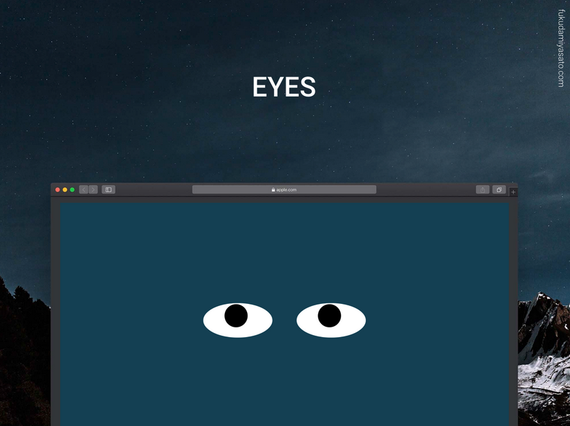

<div align="center" id="top"> 
  

  &#xa0;

</div>


<p align="center">
</p>

<p align="center">
  <a href="#dart-about">About</a> &#xa0; | &#xa0; 
  <a href="#minidisc-How-to-run">How to Run</a> &#xa0; | &#xa0; 
  <a href="#spiral_calendar-Roadmap-of-future-improvements">Roadmap</a> &#xa0; | &#xa0; 
  <a href="#sparkles-features">Features</a> &#xa0; | &#xa0;
  <a href="#rocket-technologies">Technologies</a> &#xa0; | &#xa0;
  <a href="#white_check_mark-requirements">Requirements</a> &#xa0; | &#xa0;
  <a href="#checkered_flag-starting">Starting</a> &#xa0; | &#xa0;
  <a href="#memo-license">License</a> &#xa0; | &#xa0;
  <a href="https://github.com/fukudamiyasato" target="_blank">Author</a>
</p>

<br>

## :dart: About ##

Web que usa javascript para traquear la posición del puntero y por medio de css mueve los ojos del diseño, trabajo para el curso de Fullstack. (<a href="https://fukudamiyasato.github.io/MITEye" target="_blank">Link</a>)

## :minidisc: How to run ##

No necesita instalación especial, solo abrir el archivo index.html en un navegador web. Para editar tener instalado node.

## :spiral_calendar: Roadmap of future improvements ##

:black_circle: Cambiar los diseños de la cara\
:black_circle: Colocar una botonera para hacer cambios entre diferentes caras

## :sparkles: Features ##

:heavy_check_mark: La posición del puntero del mouse mueve los ojos del proyecto\

## :rocket: Technologies ##

Se usaron las siguientes herramientas en el proyecto:

- [HTML]
- [CSS]
- [JAVASCRIPT]

## :white_check_mark: Requirements ##

Antes de empezar :checkered_flag:, necesitas tener [Git](https://git-scm.com) y [Node](https://nodejs.org/en/) instalado.

## :checkered_flag: Starting ##

```bash
# Clone this project
$ git clone https://github.com/fukudamiyasato/MITEye

# The server will initialize in the <http://localhost:3000>
```

## :memo: License ##

This project is under license from MIT. For more details, see the [LICENSE](LICENSE.md) file.


Hecho con :heart: por <a href="https://github.com/fukudamiyasato" target="_blank">Fukuda Miyasato</a>

&#xa0;

<a href="#top">Regresar</a>
